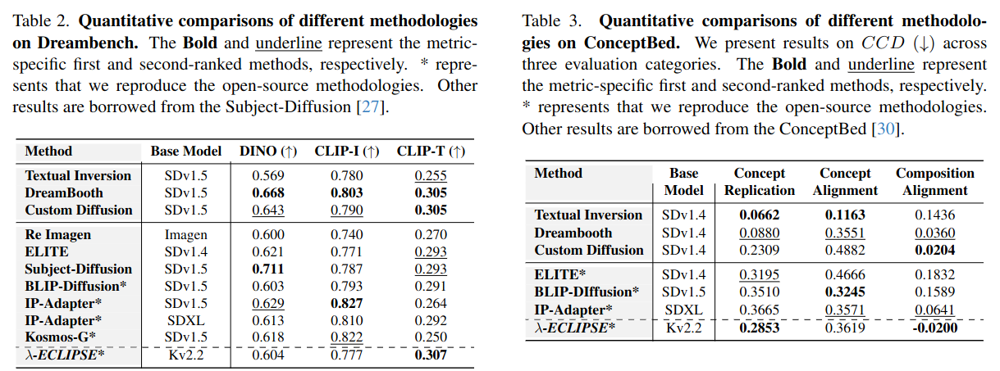

## <div align="center"> <i>&lambda;-ECLIPSE</i>: Multi-Concept Personalized Text-to-Image Diffusion Models by Leveraging CLIP Latent Space </div>

<div align="center">
  <a href="https://eclipse-t2i.github.io/Lambda-ECLIPSE/"></a> &ensp;
  <a href="#"></a> &ensp;
  <a href="https://huggingface.co/ECLIPSE-Community/Lambda-ECLIPSE-Prior-v1.0"></a> &ensp;

</div>

---

This repository contains the inference code for our paper, &lambda;-ECLIPSE.

- The &lambda;-ECLIPSE model is a light weight support for multi-concept personalization. &lambda;-ECLIPSE is tiny T2I prior model designed for Kandinsky v2.2 diffusion image generator.

- &lambda;-ECLIPSE model extends the [ECLIPSE-Prior](https://huggingface.co/ECLIPSE-Community/ECLIPSE_KandinskyV22_Prior)  via incorporating the image-text interleaved data.

- &lambda;-ECLIPSE shows that we do not need to train the Personalized T2I (P-T2I) models on lot of resources. For instance, &lambda;-ECLIPSE is trained on mere 74 GPU Hours (A100) compared to it's couterparts BLIP-Diffusion (2304 GPU hours) and Kosmos-G (12300 GPU hours).

> **_News:_**  Checkout our previous work, [ECLIPSE](https://eclipse-t2i.vercel.app/) on resource effeicient T2I.


**Please follow the below steps to run the inference locally.**

---

**Qualitative Examples:**


**Quantitative Comparisons:**



## Setup

### Installation
```bash
git clone git@github.com:Maitreyapatel/lambda-eclipse-inference.git

conda create -p ./venv python=3.9
pip install -r requirements.txt
```

## Run Inference

**Note:** &lambda;-ECLIPSE prior is not a diffusion model -- while image decoders are.

Therefore, we first need to load the prior mdoel and then Kandinsky v2.2 Image generator.

```bash
# run the inference:
conda activate ./venv

python test.py --prompt="a cat wearing glasses at a park" --subject1_path="./assets/cat.png" --subject1_name="cat" --subject2_path="./assets/cat.png" --subject2_name="glasses"

## results will be stored in ./assets/
```

## Run Demo
```bash
conda activate ./venv
gradio main.py
```


## ECLIPSE-only inference example


### Kandinsky Inference
```python
from transformers import CLIPTextModelWithProjection, CLIPTokenizer
from src.pipelines.pipeline_kandinsky_prior import KandinskyPriorPipeline
from src.priors.prior_transformer import PriorTransformer
from diffusers import DiffusionPipeline

text_encoder = (
    CLIPTextModelWithProjection.from_pretrained(
        "laion/CLIP-ViT-bigG-14-laion2B-39B-b160k",
        projection_dim=1280,
        torch_dtype=torch.float32,
    )
) 

tokenizer = CLIPTokenizer.from_pretrained(
    "laion/CLIP-ViT-bigG-14-laion2B-39B-b160k"
)

prior = PriorTransformer.from_pretrained("ECLIPSE-Community/ECLIPSE_KandinskyV22_Prior")
pipe_prior = KandinskyPriorPipeline.from_pretrained("kandinsky-community/kandinsky-2-2-prior",    
  prior=prior,
  text_encoder=text_encoder,
  tokenizer=tokenizer,
).to("cuda")

pipe = DiffusionPipeline.from_pretrained("kandinsky-community/kandinsky-2-2-decoder").to("cuda")

prompt = "black apples in the basket"
image_embeds, negative_image_embeds = pipe_prior(prompt).to_tuple()
images = pipe(
    num_inference_steps=50,
    image_embeds=image_embeds,
    negative_image_embeds=negative_image_embeds,
).images

images[0]
```

# Acknowledgement

We would like to acknoweldge excellent open-source text-to-image models (Kalro and Kandinsky) without them this work would not have been possible. Also, we thank HuggingFace for streamlining the T2I models.
