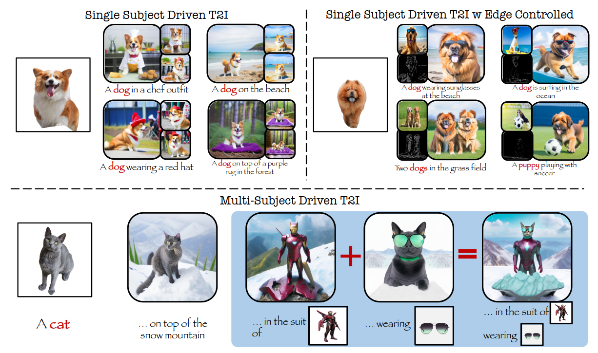

## <div align="center"> [TMLR - Nov'24] <i>&lambda;-ECLIPSE</i>: Multi-Concept Personalized Text-to-Image Diffusion Models by Leveraging CLIP Latent Space </div>

<div align="center">
  <a href="https://eclipse-t2i.github.io/Lambda-ECLIPSE/"></a> &ensp;
  <a href="https://arxiv.org/abs/2402.05195"></a> &ensp;
  <a href="https://huggingface.co/ECLIPSE-Community/Lambda-ECLIPSE-Prior-v1.0"></a> &ensp;
  <a href="https://colab.research.google.com/drive/1VcqzXZmilntec3AsIyzCqlstEhX4Pa1o?usp=sharing" target="_parent"></a>
  <br>
  <br>
  <i style="font-size: 36px">Version 2 of the paper is out!</i>
</div>

---

## 🚀 Latest Updates (April 2024)

- 🔥🔥🔥 **Concept-specific finetuning:** DreamBooth style concept-based fine-tuning is now available **(without catastrophic forgetting)**!!
    - [Click here to perform custom finetuning.](#concept-specific-finetuning)
- 🔥🔥🔥 **Multi-concept interpolation:** [Quick and easy script](#🚀-multiconcept-interpolation) to perform multiconcept interpolations!! 
- 🔥🔥 **Benchmark Release:** [Multibench (DropBox)](https://www.dropbox.com/scl/fo/1jn76jgducvfdciz1apa0/AMjI60khvN4Wx7bcB9C8oZw?rlkey=wevmnmf9jhwzrche9e9w6tr97&dl=0) -- Complex multi-subject personalization benchmark. This includes images with and without background.

> **_News:_**  Checkout our previous work, [ECLIPSE](https://eclipse-t2i.vercel.app/) on resource effeicient T2I accepted @ CVPR 2024.

## Overview

This repository contains the inference code for our paper, &lambda;-ECLIPSE.

- The &lambda;-ECLIPSE model is a light weight support for multi-concept personalization. &lambda;-ECLIPSE is tiny T2I prior model designed for Kandinsky v2.2 diffusion image generator.

- &lambda;-ECLIPSE model extends the [ECLIPSE-Prior](https://huggingface.co/ECLIPSE-Community/ECLIPSE_KandinskyV22_Prior)  via incorporating the image-text interleaved data.

- &lambda;-ECLIPSE shows that we do not need to train the Personalized T2I (P-T2I) models on lot of resources. For instance, &lambda;-ECLIPSE is trained on mere 74 GPU Hours (A100) compared to it's couterparts BLIP-Diffusion (2304 GPU hours) and Kosmos-G (12300 GPU hours).


**Please follow the below steps to run the inference locally.**

---



## Setup

### Installation
```bash
git clone git@github.com:eclipse-t2i/lambda-eclipse-inference.git

conda create -p ./venv python=3.9
pip install -r requirements.txt
```

## Run Inference
<a href="https://colab.research.google.com/drive/1VcqzXZmilntec3AsIyzCqlstEhX4Pa1o?usp=sharing" target="_parent"></a>


**Note:** &lambda;-ECLIPSE prior is not a diffusion model -- while image decoders are.

We recommend either referring to the colab notebook or [test.py](test.py) script to understand the inner working of &lambda;-ECLIPSE.

- Additionally, for stronger Canny edge controlled results, we refer the  users to use `ControlNet` models, as &lambda;-ECLIPSE's goal is not to strongly follow Canny edge map but find the **balance between target concepts and canny edge map** to produce the most optimal results with some trade-off.

```bash
# run the inference:
conda activate ./venv

# single-subject example
python test_quick.py --prompt="a cat on top of the snow mountain" --subject1_path="./assets/cat.png" --subject1_name="cat"

# single-subject canny example
python ./test_quick.py --prompt="a dog is surfing" --subject1_path="./assets/dog2.png" --subject1_name="dog" --canny_image="./assets/dog_surf_ref.jpg"

# multi-subject example
python test_quick.py --prompt="a cat wearing glasses at a park" --subject1_path="./assets/cat.png" --subject1_name="cat" --subject2_path="./assets/blue_sunglasses.png" --subject2_name="glasses"

## results will be stored in ./assets/
```

## Run Demo
```bash
conda activate ./venv
gradio main.py
```

## Concept-specific finetuning

🔥🔥🔥 **All concepts combined training:**
```bash
export DATASET_PATH="<path-to-parent-folder-containing-concept-specific-folders>"
export OUTPUT_DIR="<output-dir>"
export TRAINING_STEPS=8000 # for 30 concepts --> ~250 iterations per concept

python train_text_to_image_decoder_whole_db.py \
        --instance_data_dir=$DATASET_PATH \
        --subject_data_dir=$DATASET_PATH \
        --output_dir=$OUTPUT_DIR \
        --validation_prompts='A dog' \
        --resolution=768 \
        --train_batch_size=1 \
        --gradient_accumulation_steps=4 \
        --gradient_checkpointing \
        --max_train_steps=$TRAINING_STEPS \
        --learning_rate=1e-05 \
        --max_grad_norm=1 \
        --checkpoints_total_limit=3 \
        --lr_scheduler=constant \
        --lr_warmup_steps=0 \
        --report_to=wandb \
        --validation_epochs=1000 \
        --checkpointing_steps=1000 \
        --push_to_hub
```

**Individual concept training:**
```bash
export DATASET_PATH="<path-to-folder-containing-images>"
export OUTPUT_DIR="<output-dir>"
export CONCEPT="<high-level-concept-name-like-dog>" # !!! Note: This is to check concept overfitting. This never supposed to generate your concept images.
export TRAINING_STEPS=400

python train_text_to_image_decoder.py \
        --instance_data_dir=$DATASET_PATH \
        --subject_data_dir=$DATASET_PATH \
        --output_dir=$OUTPUT_DIR \
        --validation_prompts="A $CONCEPT" \
        --resolution=768 \
        --train_batch_size=1 \
        --gradient_accumulation_steps=4 \
        --gradient_checkpointing \
        --max_train_steps=$TRAINING_STEPS \
        --learning_rate=1e-05 \
        --max_grad_norm=1 \
        --checkpoints_total_limit=4 \
        --lr_scheduler=constant \
        --lr_warmup_steps=0 \
        --report_to=wandb \
        --validation_epochs=100 \
        --checkpointing_steps=100 \
        --push_to_hub
```

## Combined Inference (Prior + Finetunined UNet):

To perform combined &lambda;-ECLIPSE and finetuned UNet (previous step) inference:

```bash
# run the inference:
conda activate ./venv

# single/multi subject example
python test_quick.py --unet_checkpoint="mpatel57/backpack_dog" --prompt="a backpack at the beach" --subject1_path="./assets/backpack_dog.png" --subject1_name="backpack"

## results will be stored in ./assets/
```

## 🚀 Multiconcept Interpolation

Please refer to the following script to perform interpolations on your own concepts:
```bash
python ./interpolation.py
```

# Acknowledgement

We would like to acknoweldge excellent open-source text-to-image models (Kalro and Kandinsky) without them this work would not have been possible. Also, we thank HuggingFace for streamlining the T2I models.
